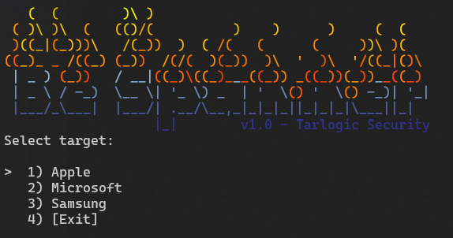

# Bluetooth Examples and Demos

A collection of Bluetooth tools, examples and demos useful for tools development based on UsbBluetooth.

## BleSpammer

A collection of Bluetooth spamming proof of concepts in a single C# application. Does not require any special hardware!

## Vendor Command Enumerator

A single Python script that enumerates all possible hidden HCI vendor commands of a device.

